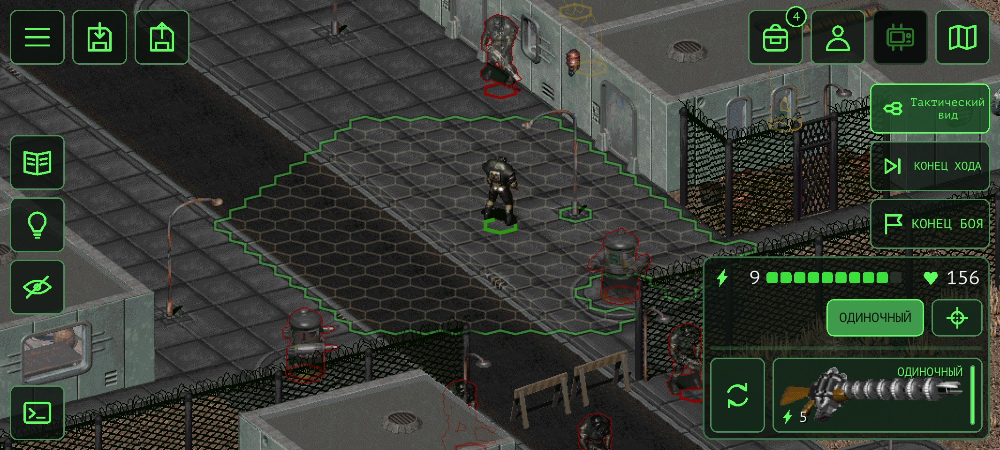
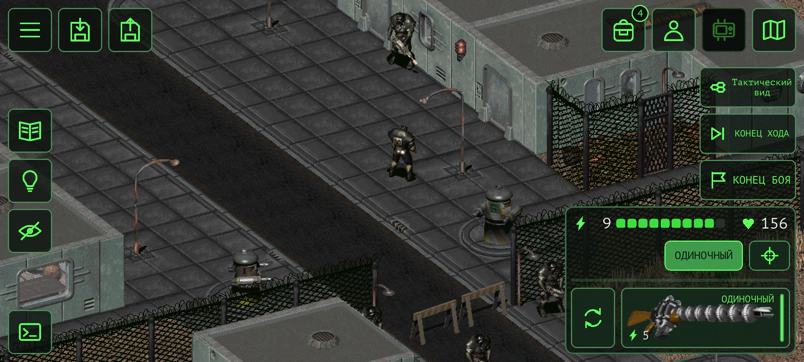
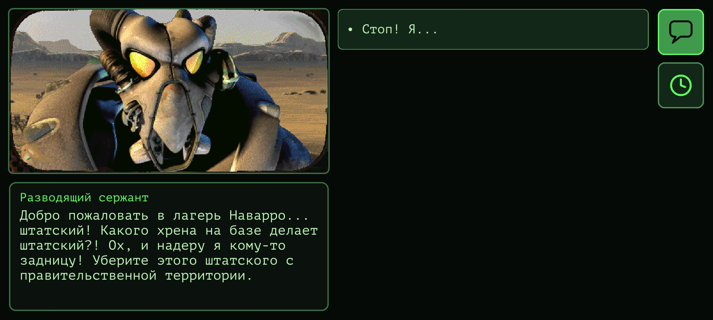
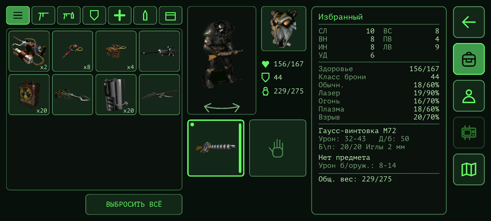
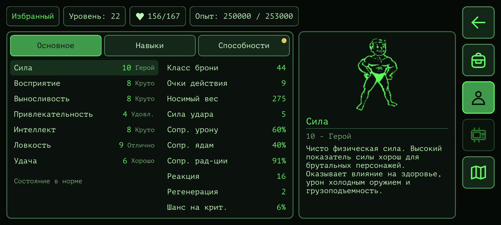

# Fallout 2 CE Mobile (неофициальная)

[English version](README.md)

Форк [Fallout 2: Community Engine](https://github.com/fallout2-ce/fallout2-ce) для телефонов на Android: все экраны игры переделаны под сенсорный экран, в альбомной ориентации. **Ранняя бета.**

Это **неофициальная любительская изменённая версия** Fallout 2 CE. Она не связана с Bethesda Softworks, ZeniMax Media и Interplay и не одобрена ими. Fallout — товарный знак его владельцев. В приложении **нет данных игры**: нужна ваша собственная копия Fallout 2 ([GOG](https://www.gog.com/game/fallout_2), [Steam](https://store.steampowered.com/app/38410), [Epic Games](https://store.epicgames.com/p/fallout-2)).

## Скриншоты



<p> </p>

<p> </p>

## Что изменено (уведомление об изменении ПО)

Поверх CE (его движок, исправления и совместимость с sfall сохранены и обновляются из оригинала):

- **Сенсорный интерфейс.** Экраны игры заменены экранами для пальцев и разрешения телефона: диалог, торговля, инвентарь, обыск, персонаж и повышение уровня, создание персонажа, Pip-Boy (задания, голодиски с озвучкой, карты, видео, отдых), автокарта, карта мира и карты городов, навыки, меню игры, настройки, сохранение и загрузка, главное меню, окна сообщений, прицельный выстрел. Без курсора: касание — действие, долгое нажатие — меню действий, перетаскивание — перенос вещей, два пальца — масштаб карты.
- **HUD.** Кнопки у краёв экрана (размеры в dp), режимы атаки с перезарядкой, журнал сообщений, конец хода и боя.
- **Тактический вид в бою** (кнопка, отключается в настройках): фигуры становятся полупрозрачными, гексы, куда можно дойти, и клетки персонажей рисуются на земле — можно выбрать клетку за врагом и выбрать врага по его клетке.
- **Возможности модов встроены**, где сами моды не работают на CE: фильтры и вкладки напарников Inventory Filter при обыске и торговле.
- **Сохранения.** Список по времени создания, быстрые сохранения никогда не затирают обычные (их число — настройка), «Продолжить» в главном меню, восстановление прерванной записи, отметки сохранений, сделанных с другими файлами игры или модами.
- **Приложение Android.** Файлы игры импортируются из папки или любого архива (.zip, .7z, .rar, .tar…), скопированных с компьютера, вместе с RPU, другими модами и сохранениями; «Заменить игру» для новых сборок и обновления модов; экспорт и импорт сохранений.
- **Собственные улучшения порта** включаются в настройках (`[enhancements]` в `fallout2.cfg`).

Полный список изменений — история git поверх оригинала.

## Установка на Android

1. Скачайте APK в [Releases](https://github.com/imbaner/fallout2-ce/releases) и установите.
2. Скопируйте папку Fallout 2 с компьютера на телефон: как есть или одним архивом (по кабелю, через облачный диск, мессенджер). Установленные моды (например, [RPU](https://github.com/BGforgeNet/Fallout2_Restoration_Project)) и сохранения перенесутся вместе с ней.
3. Запустите приложение и выберите эту папку или архив.

Проверено на Redmi 15C (Android 16). Android 7.0 и новее, arm64.

**Рекомендуемый набор: Fallout 2 + [Restoration Project (RPU)](https://github.com/BGforgeNet/Fallout2_Restoration_Project) 2.4.34.** Порт играется и проверяется именно с ним. RPU опирается на sfall, который этот движок воспроизводит: Fallout 2: Community Engine — продолжение оригинального Fallout 2 Community Edition. Установите RPU в папку игры на компьютере, затем скопируйте папку на телефон.

## Известные ограничения

- Только альбомная ориентация, портретная в планах.
- Сделано для телефонов и проверено на Android; сборки для компьютеров сохраняют исходные окна CE (`[touch] mobile_ui=0`) и не главная цель форка.
- Моды со своими окнами скриптов не поддержаны сенсорным интерфейсом (популярные их не используют).

## Сборка

Android: JDK 17, Android SDK с NDK 27.3.13750724.

```
cd os/android
./gradlew assembleRelease -PabiFilters=arm64-v8a
```

Релизная сборка подписывается вашим ключом: свойство Gradle `fallout2ce.releaseKeystoreProperties` указывает на файл с `storeFile`, `storePassword`, `keyAlias`, `keyPassword` (никогда не кладите его в репозиторий). Сборки для компьютеров — как в оригинале (CMake).

## Лицензия

Движок — под [Sustainable Use License](LICENSE.md), как и оригинал: распространение только бесплатное и некоммерческое, с сохранением лицензии и уведомлений. Сторонние компоненты: SDL 2, zlib, LodePNG (лицензия zlib), libarchive (BSD), liblzma из XZ Utils (0BSD), stb (MIT / общественное достояние), fpattern, шрифт PT Mono (SIL OFL 1.1). Приложение показывает их все в «Настройки → О программе».

Благодарности: Александру Баталову и участникам Fallout 2 CE — за движок; авторам sfall, RPU и Inventory Filter — их возможности сделаны здесь заново по поведению, без заимствования кода.
